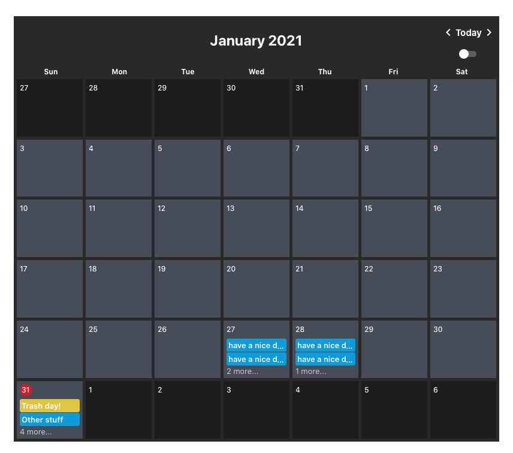

# Shaun's Calendar Challenge! 🗓

The challenge here is to **create a reusable, vanilla-React calendar component**

## Functionalities that are implemented
  Allow users to 
 - add/remove events
 - view events
 - click next/previous to navigate to other months

## Responsive limit
The minimum width and height for the calender is `400px`. Any width/height lower than that will cause the events impossible to see. Probably need to rearrange the calender layout based on the width and height of the container that the calender is passed into. But that's not so easy to do since acheiving responsive layout is mainly through using media query, which is designed to work based on devices or media types. In this case, I need the so-called <b>Container Query</b>. Philip Walton provides a solution to [this](https://philipwalton.com/articles/responsive-components-a-solution-to-the-container-queries-problem/). 

## Other things
 - The switch toggle currently does nothing. It's used for color mode switching. (I will do it probably later when I have time)
 - The events are currently passing down from `Calender` component to each `DateCell` components, and then to `EventList` component,
 any update to the events will triggle this data flow again. It's hard to maintain. React Context is sufficient to fix it.
 - Currently, the calender will not store the newly created events(they will be gone once refresh), because I don't have a database for storing events.
 
## Libraries
 - Use `material-ui` mainly for the popover and the icons.

## Getting the app running

1. Clone this repo with: `git clone https://github.com/wahjay/calendar.git calender-challenge`
2. `cd calendar-challenge`
3. Install dependencies: `npm install`
4. Run it: `npm run start`
5. See it running on localhost:3000
